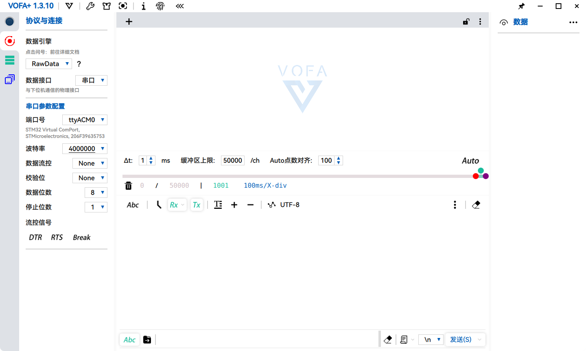

在Vofa+官网下载deb包并安装以后发现应用程序无法打开，在终端中输入
```bash
/usr/bin/vofa+
```
可以得到报错信息：
```
vofa+: error while loading shared libraries: libcrypto.so.1.1: cannot open shared object file: No such file or directory
```
可以看到是缺少`libcrypto.so.1.1`库导致的，让我们到Vofa+的lib文件夹下检查库文件
```bash
ll /opt/vofa+/lib/libcrypto*
```
会发现该目录下存在一个类似的库文件：
```
-rwxr-xr-x 1 root root 3169648  3月 14  2021 /opt/vofa+/lib/libcrypto-1_1-x64.so*
```
基本可以判定是Vofa+调用库的时候链接名称不匹配导致的，我们直接创建一个软链接指向缺失的文件名：
```bash
sudo ln -s /opt/vofa+/lib/libcrypto-1_1-x64.so /opt/vofa+/lib/libcrypto.so.1.1
```
重新打开Vofa+，出现我们熟悉的界面，到此问题解决。
